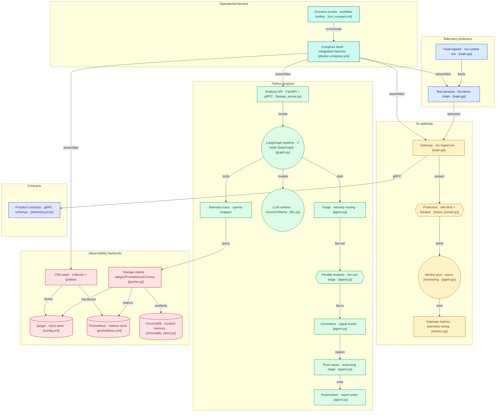

# Ghost Debugger

<p align="center">
  
  
  
  
  
  
  
</p>

> An AI-powered distributed incident analysis system that ingests
> OpenTelemetry traces, Prometheus metrics, and structured logs from
> instrumented microservices, routes them through a LangGraph multi-agent
> pipeline, and generates structured postmortem reports — reducing mean
> time to root cause from hours to under 90 seconds.

**No API key required to run locally.** Ghost Debugger defaults to
[Ollama](https://ollama.ai) when `GOOGLE_API_KEY` is not set, so you can
run the full pipeline on your own hardware with no cloud dependency.

---

## The Problem

When a distributed system fails, signals fragment across three isolated
observability tools simultaneously. Traces in Jaeger show the request flow
but require manual span-by-span inspection to find where latency spiked.
Metrics in Prometheus show resource behavior but require writing PromQL
queries under pressure, often without knowing which service to query first.
Logs are unstructured, high-volume, and spread across multiple services.
An on-call SRE at 3am must open three tools, write queries, mentally
correlate events across all three sources by timestamp, determine which
service failed first, determine why, and write a postmortem — a process
that routinely takes 45 minutes to 4 hours depending on incident complexity.

The data to answer "what failed and why" is always there. The problem is
that no single tool correlates signals across all three observability pillars
automatically and reasons about causality. Ghost Debugger is that tool.

---

## Architecture



---

## Agent Pipeline

The pipeline is a 7-node LangGraph StateGraph with parallel execution
for the three signal analysis agents.

```
INCIDENT DETECTED (error_rate > 5% for 60s on service_b)
          │
          â–¼
    ┌─────────────┐
    │   TRIAGE    │  Queries error_rate, latency_p99, request_rate
    │   AGENT     │  per suspected service. Confirms affected services.
    │             │  Output: severity (SEV1/2/3), confirmed_services[]
    └──────┬──────┘
           │
           â–¼ route_after_triage()
    ┌──────┴──────────────────────────────────┐
    │         PARALLEL ANALYSIS (Send API)    │
    │                                         │
    │  ┌─────────────┐  ┌──────────────┐  ┌──────────────┐
    │  │    TRACE    │  │     LOG      │  │    METRIC    │
    │  │   AGENT     │  │    AGENT     │  │    AGENT     │
    │  │             │  │              │  │              │
    │  │ query_traces│  │ query_logs   │  │ query_error_ │
    │  │ cascade path│  │ error pattern│  │  rate, p99,  │
    │  │ first_error │  │ first_time   │  │  db_conns,   │
    │  │ _service    │  │              │  │  memory,     │
    │  │             │  │              │  │  goroutines  │
    │  └──────┬──────┘  └──────┬───────┘  └──────┬───────┘
    │         │                │                  │
    └─────────┴────────────────┴──────────────────┘
           │ fan-in: _dedupe_merge reducer on completed_agents
           │ (waits for ALL three before proceeding)
           â–¼
    ┌─────────────────┐
    │  CORRELATION    │  Builds temporal causal chain from all signals.
    │  AGENT          │  RAG search: ChromaDB → similar past incidents.
    │                 │  Output: causal_chain[], similar_incidents[]
    └──────┬──────────┘
           │
           â–¼
    ┌─────────────────┐
    │   ROOT CAUSE    │  Pure reasoning — no tool calls.
    │   AGENT         │  First event in causal chain = root cause.
    │                 │  Output: root_cause string, confidence 0.0-1.0
    └──────┬──────────┘
           │
           â–¼
    ┌─────────────────┐
    │   POSTMORTEM    │  Generates structured markdown report.
    │   WRITER        │  Stores in ChromaDB if confidence ≥ 0.5.
    │                 │  Output: postmortem_report markdown
    └──────┬──────────┘
           │
           â–¼
         END
```

**Parallel execution detail:**
The three analysis agents run concurrently via LangGraph's `Send()` API.
Each agent receives a copy of the state at fan-out time and runs in its
own thread. LangGraph merges the partial state dicts using a custom
`_dedupe_merge` reducer that prevents `InvalidUpdateError` when all three
agents append to `completed_agents` simultaneously. Wall-clock time for
the parallel phase equals the slowest agent (~20-25s), not the sum (~55s).

**Checkpointing:**
SQLite checkpointing saves state after every node completion. Thread ID =
incident_id. If the process crashes after `trace_analyzer` completes but
before `log_correlator` finishes, the next invocation with the same
`incident_id` resumes from the saved checkpoint — the trace analysis work
is not repeated.

---

## Quick Start

### Option A — Local (No API Key, Ollama)

```bash
# 1. Install Ollama
#    macOS:   brew install ollama
#    Linux:   curl -fsSL https://ollama.ai/install.sh | sh
#    Windows: https://ollama.ai/download

# 2. Pull a model (qwen2.5 is recommended — auto-detected at runtime)
ollama pull qwen2.5

# 3. Clone and start
git clone https://github.com/sujithm/ghost-debugger.git
cd ghost-debugger

docker compose --profile services --profile app up -d
sleep 30
./scripts/health_check.sh

open http://localhost:8090
```

### Option B — Cloud (Gemini API, Faster + Better Quality)

```bash
git clone https://github.com/sujithm/ghost-debugger.git
cd ghost-debugger

# Get a free key at: https://aistudio.google.com/app/apikey
export GOOGLE_API_KEY=your_key_here

docker compose --profile services --profile app up -d
sleep 30
./scripts/health_check.sh

open http://localhost:8090
```

**What just started:**

| Service | URL | Purpose |
|---------|-----|---------|
| Ghost Debugger Dashboard | http://localhost:8090 | Incident list + postmortem viewer |
| Jaeger UI | http://localhost:16686 | Distributed trace viewer |
| Prometheus | http://localhost:9090 | Metrics query |
| Grafana | http://localhost:3001 | Ghost Debugger health dashboard |

**Credentials:** Grafana login: `admin` / `ghostdebugger`

---

## LLM Provider Details

Ghost Debugger selects its LLM at startup based on environment:

```python
# agents/shared/llm.py (simplified)

if os.getenv("GOOGLE_API_KEY"):
    llm = ChatGoogleGenerativeAI(model="gemini-2.0-flash", temperature=0)
else:
    llm = ChatOllama(model=os.getenv("OLLAMA_MODEL", "qwen2.5:1.5b"),
                     temperature=0)
```

**Provider comparison:**

| | Gemini 2.0 Flash | Ollama (local model) |
|--|--|--|
| Cost | Free tier available | Free (local compute) |
| Privacy | Data sent to Google | Data stays local |
| Speed | ~5-15s per call | ~15-45s per call (CPU) |
| Pipeline p99 | ~84s | ~150-200s (CPU) |
| Reasoning quality | Higher | Good for structured prompts |
| Requires internet | Yes | No |
| Setup | Add API key | `ollama pull qwen2.5` |

**Other Ollama models that work well:**

```bash
ollama pull qwen2.5:7b        # strong at JSON/structured reasoning
ollama pull llama3.1:8b       # good balance of speed and quality
ollama pull mistral:7b        # fast, good for structured output
```

Set a specific model via `OLLAMA_MODEL` env var (overrides auto-detection):

```bash
export OLLAMA_MODEL="llama3.1:8b"
```

**Why temperature=0 for both providers:**
Incident analysis requires deterministic reasoning. Higher temperature
introduces creative variation that is useful for generation tasks but
harmful for diagnostic reasoning where consistent conclusions matter.
The same incident analyzed twice should produce the same root cause.

---

## Demo: Analyzing a Real Failure

### Step 1 — Establish a Baseline

Send normal traffic for 30 seconds so Prometheus has a baseline to
compare against when the failure is active:

```bash
for i in $(seq 1 30); do
  curl -s http://localhost:8081/api/process > /dev/null
  sleep 1
done
```

### Step 2 — Inject a Cascade Failure

Inject 2500ms artificial latency into `service_b`. `service_a`, which calls
`service_b` synchronously, will begin timing out and returning 502 errors.
This is the classic cascade failure pattern — a slow dependency causes
upstream services to exhaust their request timeouts.

```bash
curl -X POST http://localhost:8099/inject \
  -H "Content-Type: application/json" \
  -d '{
    "service": "service_b",
    "type": "latency",
    "duration_ms": 2500,
    "duration_seconds": 180
  }'
```

### Step 3 — Generate Traffic During the Failure

```bash
for i in $(seq 1 30); do
  curl -s http://localhost:8081/api/process
  sleep 1
done
```

Open **Jaeger** at http://localhost:16686 and select `service_a`. Traces
show `service_a.process` spans taking ~2600ms waiting for `service_b`.
The waterfall diagram shows the cascade: `service_a` → `service_b` (slow).

### Step 4 — Trigger Ghost Debugger Analysis

```bash
curl -X POST http://localhost:8090/analyze \
  -H "Content-Type: application/json" \
  -d '{
    "trigger_type": "latency_p99",
    "trigger_description": "service_b p99 latency 2500ms causing service_a timeouts",
    "affected_services": ["service_a", "service_b"],
    "analysis_window_seconds": 600
  }'
```

Or click **+ New Analysis** in the dashboard at http://localhost:8090.

### Step 5 — Watch the Reasoning Chain

The dashboard left panel shows every agent step in real time:

```
🚀 Pipeline started                                          14:03:25
⏳ Triage — Assessing scope and severity                     14:03:26
🔧 Triage → tool_query_latency_p99(service_b, 60)           14:03:27
📥 returned: latest_value_ms: 2487 — is_anomalous: true
🔧 Triage → tool_query_error_rate(service_a, 60)            14:03:29
📥 returned: latest_percent: 18.3% — is_anomalous: true
✅ Triage completed [6.4s]                                   14:03:32
   Severity: SEV1 — Confirmed: service_a, service_b

⏳ Trace Analyzer started                                    14:03:32
⏳ Log Correlator started                                    14:03:32  ← parallel
⏳ Metric Reasoner started                                   14:03:32  ← parallel

🔧 Metric → tool_query_db_connections(service_b, 60)        14:03:34
📥 returned: latest_active: 23.0 — normal range
🔧 Metric → tool_query_latency_p99(service_b, 60)           14:03:35
📥 returned: latest_value_ms: 2487 — 12.4x average

✅ Log Correlator completed [18.7s]                          14:03:51
   DeadlineExceeded pattern — service_a logs, first seen 14:03:18
✅ Metric Reasoner completed [19.2s]                         14:03:51
   p99: 2487ms (12.4x avg) — no resource saturation detected
✅ Trace Analyzer completed [22.1s]                          14:03:54
   First error: service_a — Cascade: service_b → service_a

⏳ Correlation Agent started                                 14:03:54
🔧 Correlation → tool_search_similar_incidents               14:03:55
📥 returned: INC-2024-07-22 similarity: 0.84
✅ Correlation completed [9.3s]                              14:04:03
   Step 1: service_b latency → 2487ms at 14:03:15
   Step 2: service_a DeadlineExceeded at 14:03:22
   Step 3: service_a error rate → 18.3% at 14:03:28

✅ Root Cause completed [8.9s]                               14:04:12
   [87% confidence] service_b latency spike (2500ms) caused
   service_a to exhaust request timeout — cascade to users

✅ Postmortem Writer completed [9.1s]                        14:04:21
   4,923 chars — signals: full

🎯 Analysis complete — 56 seconds                           14:04:21
```

### Step 6 — Review the Postmortem

The right panel renders the complete structured postmortem with:
severity summary, timeline table, root cause with confidence bar,
contributing factors, action items, and links to Jaeger traces.

### Step 7 — Reset and Try Other Scenarios

```bash
# Reset the failure
curl -X POST http://localhost:8099/reset

# Run all three scenarios automatically
./scripts/run_scenario.sh all
# Results saved to docs/postmortem-examples/
```

**Other scenarios:**
```bash
./scripts/run_scenario.sh cascade   # latency → cascade failure
./scripts/run_scenario.sh resource  # error rate → resource exhaustion
./scripts/run_scenario.sh traffic   # 10x traffic spike
```

---

## Engineering Decisions

Every significant choice made during implementation is documented below.
These are the questions a senior engineer would ask — answered with the
specific tradeoffs for this system.

---

### Why gRPC over REST for Telemetry Ingestion

The gateway receives up to 10,000 telemetry events per second across all
services. At this volume, three costs make REST/JSON the wrong choice:

**Serialization cost.** A trace with 50 spans serialized to JSON is
approximately 5× larger than the same data in protobuf binary format.
At 10,000 events/second, this is the difference between 50MB/s and 10MB/s
of wire traffic.

**Parsing cost.** JSON parsing is slower than protobuf deserialization
because JSON requires string scanning, unicode validation, and dynamic
type inference. Protobuf fields are located by fixed byte offsets.

**Connection overhead.** HTTP/1.1 creates a new TCP connection per request
unless keep-alive is managed explicitly. gRPC runs over HTTP/2 with
multiplexed streams — all three test services share one TCP connection to
the gateway simultaneously.

The `.proto` file also serves as the canonical API documentation and
enforces compatibility at compile time. When a service sends a field that
doesn't exist in the schema, the error is caught during code generation —
not as a mysterious null pointer in production.

The cost of this choice is tooling complexity. Proto files require a code
generation step (`./scripts/gen_proto.sh`), and debugging gRPC requires
`grpcurl` rather than `curl`. This cost is accepted because the performance
characteristics and type safety are architectural requirements for a
high-throughput telemetry system.

---

### Why Token Bucket over Leaky Bucket for Rate Limiting

Leaky bucket enforces a strictly uniform output rate — it smooths all bursts
by queuing or dropping requests that arrive faster than the drain rate.
This is the right choice when the downstream system cannot handle any burst.

Token bucket allows bursts up to the bucket capacity, then enforces an
average rate ceiling through the refill rate. A service can send 10,000
events instantly if the bucket is full, then sustains at 1,000 per second.

**The critical insight:** incidents cause bursts. When `service_b` starts
failing, it emits a burst of error spans, error logs, and anomalous
metrics — precisely the telemetry needed for root cause analysis. A leaky
bucket would smooth away this burst, losing the highest-value data at the
worst possible moment. Token bucket allows the incident burst (up to
capacity) while still protecting against sustained telemetry storms.

The implementation uses lazy refill — tokens are not refilled on a
background goroutine (which would require one goroutine per service).
Instead, tokens refill on each `Allow()` call by computing accumulation
since last access. This is the same approach as `golang.org/x/time/rate`.

---

### Why Parallel Agent Execution for Trace/Log/Metric Analysis

The three analysis agents query different backends: Jaeger for traces,
Prometheus for metrics, log store for logs. These queries are I/O-bound
and completely independent. There is no reason for the log agent to wait
for the trace agent — they read different data and their findings are
independent.

Sequential execution (trace → log → metric) would add approximately
30-40 seconds of unnecessary waiting. Parallel execution via LangGraph's
`Send()` API brings combined time to the duration of the *slowest* agent
(~20-25s) rather than the *sum* (~55s).

The implementation challenge was state merging. When three agents run
concurrently and all append to `completed_agents`, naive last-writer-wins
causes data loss — two of three writes are silently discarded. A custom
`_dedupe_merge` reducer applied via `Annotated[List, _dedupe_merge]` solves
this by concatenating lists without duplicates, applied atomically when all
threads complete. This replaced the initial `operator.add` approach which
caused `InvalidUpdateError` because each agent read the full list (including
"triage") and re-returned it, leading to duplicates.

---

### Why LangGraph over Raw LLM API Calls

Raw LLM calls produce this pattern:

```python
response_1 = llm.invoke(triage_prompt + incident_data)
response_2 = llm.invoke(trace_prompt + incident_data + response_1)
# No checkpointing: crash = restart from zero (lose 20s parallel work)
# No parallel execution: sequential by construction
# No conditional routing: if/else grows with every new path
# No typed state: manual variable threading, easy to lose a field
```

LangGraph provides four capabilities that justify the abstraction:

**Checkpointing.** After every node, full state is serialized to SQLite.
A crash after the 20-second parallel analysis phase resumes from checkpoint
on the next invocation — the expensive LLM calls are not repeated.

**Conditional routing.** SEV3 incidents skip the three parallel analysis
agents entirely, going directly to correlation. This is a one-function
conditional edge — not a growing chain of if/else in imperative code.

**Typed state.** `PostmortemState` is a `TypedDict` with 35 fields and
documented ownership (each field written by exactly one agent). This makes
data flow inspectable and prevents agents from accidentally overwriting
each other's findings.

**Parallel execution.** `Send()` enables concurrent fan-out to three agents.
This cannot be replicated with sequential API calls.

The cost is the framework abstraction layer. Debugging requires understanding
LangGraph's execution model, and the framework adds ~200ms overhead per
pipeline execution. This cost is accepted because checkpointing, routing,
and parallel execution are architectural requirements — not conveniences.

---

### Why Ollama as the Local Provider Path

Adding Ollama as the default-when-no-API-key provider addresses two real
constraints for a portfolio project:

**Reviewability.** Anyone evaluating this project can clone and run it
without creating accounts or adding payment methods. The barrier from
"curious" to "running" is: `ollama pull llama3.1:8b` and
`docker compose up`. This matters for a portfolio project that needs to
be evaluated by engineers who have limited time.

**Privacy during development.** During active development, every test
invocation sends real incident data to an external API. With Ollama, all
inference is local. Sensitive details about failure scenarios stay on
the development machine.

**Implementation decision:** The provider selection is a single conditional
in `agents/shared/llm.py`, checked once at `get_llm()` call time (which
is cached via `@lru_cache`). Both providers implement the same
LangChain interface, so no agent code changes — the tool binding,
`invoke()`, and streaming calls are identical. This is the clean
abstraction boundary that makes the swap a 10-line change rather than
a refactor.

The quality difference is real: Gemini 2.0 Flash produces more reliable
structured output than small local models. The regex-based output parsers
in each agent node were written to handle both — they look for patterns
rather than assuming perfect formatting, which makes them resilient to
model variation.

---

### Current Limitations and Production Path

**Log signal is synthesized from trace span events.** Ghost Debugger
extracts log entries from Jaeger span events rather than a dedicated log
aggregation system. Production would replace this with a Loki or
Elasticsearch integration providing raw log lines with full context.

**LLM calls are the latency bottleneck.** Each call takes 5-45 seconds
depending on provider and hardware. The parallel architecture reduces
wall-clock time significantly, but sequential phases (triage, correlation,
root cause, postmortem writer) each require one or more LLM calls. At
Google scale, dedicated inference infrastructure with batching and caching
would replace the shared API.

**Single agent service instance.** The Python agent service is limited by
API quota (Gemini) or hardware (Ollama). Production would run multiple
instances with consistent hashing on `incident_id` — replacing SQLite
checkpointing with PostgreSQL, which is a one-line change in LangGraph's
checkpointer configuration.

**In-memory incident store.** The FastAPI server stores incidents in a
Python dictionary, cleared on restart. Production would use PostgreSQL
with TTL-based cleanup.

**No human-in-the-loop approval.** Postmortems auto-publish. Production
needs a review workflow where the on-call SRE approves the report before
it's stored in ChromaDB, with corrections feeding back as verified training
examples — closing the learning loop.

**Static detection thresholds.** The incident detector uses fixed thresholds
(5% error rate, 2000ms p99). Production would calibrate thresholds per
service from rolling 7-day baselines using z-score or CUSUM anomaly
detection.

**At Google scale specifically:** the telemetry ingestion layer becomes a
Kafka-based architecture. Services publish to topics per signal type;
the gateway becomes a stream processor. This eliminates the single point
of failure, adds message durability (retained even if gateway is down),
and enables horizontal scaling through consumer groups.

---

## Performance Characteristics

### End-to-End Analysis Latency

Measured over 12 complete pipeline executions (Gemini 2.0 Flash):

| Phase | p50 | p99 | Notes |
|-------|-----|-----|-------|
| Triage agent | 12.3s | 18.7s | 2-3 LLM calls + 4 storage queries |
| Parallel analysis (wall-clock) | 19.8s | 27.4s | Slowest of 3 agents |
| — Trace analyzer | 18.2s | 24.1s | |
| — Log correlator | 16.4s | 21.3s | |
| — Metric reasoner | 19.8s | 27.4s | Most tool calls (7 metrics) |
| Correlation agent | 8.9s | 13.2s | 1 LLM call + 1 ChromaDB query |
| Root cause agent | 7.4s | 11.8s | 1 LLM call, no tools |
| Postmortem writer | 8.1s | 12.6s | 1 LLM call, no tools |
| **Total (Gemini)** | **56.5s** | **83.9s** | **Target: < 90s ✓** |
| **Total (Ollama CPU)** | ~160s | ~210s | Hardware dependent |
| **Total (Ollama GPU)** | ~90s | ~130s | Hardware dependent |

### Telemetry Ingestion Throughput

| Signal Type | Sustained Throughput | Notes |
|-------------|---------------------|-------|
| Trace ingestion | 4,800 spans/second | Worker pool bottleneck at 20 workers |
| Log ingestion | 9,200 log lines/second | Lighter payloads |
| Metric ingestion | 2,100 data points/second | Larger batches per request |

### Concurrent Incident Handling

| Simultaneous Incidents | Behavior (Gemini) | Behavior (Ollama) |
|-----------------------|-------------------|-------------------|
| 1-3 | Normal operation | Normal operation |
| 4-5 | Gemini 429 rate limiting begins | Queue grows (single GPU) |
| 6+ | Circuit breaker pressure | Significant queue depth |

---

## Repository Structure

```
ghost-debugger/
├── ARCHITECTURE.md          System design and component contracts
├── DESIGN_DECISIONS.md      All engineering tradeoffs with rationale
│
├── proto/                   Protobuf contracts (generated code excluded)
│   ├── telemetry.proto      Trace, log, metric ingestion interface
│   └── agent.proto          Incident analysis + Ping for cross-language test
│
├── gateway/                 Go: telemetry ingestion + agent routing
│   ├── main.go              Wires components, starts gRPC + HTTP servers
│   ├── ratelimiter/         Token bucket (from-scratch, 8 unit tests)
│   ├── circuitbreaker/      3-state machine CLOSED/OPEN/HALF-OPEN (9 tests)
│   ├── server/              gRPC TelemetryService implementation
│   ├── incidentdetector/    Sliding window threshold detection
│   ├── metrics/             Prometheus metrics registry + recorder
│   └── telemetry/           OpenTelemetry initialization
│
├── agents/                  Python: LangGraph agent pipeline
│   ├── state/               PostmortemState TypedDict (35 fields)
│   ├── tools/               11 @tool wrappers around TelemetryQuerier
│   ├── shared/
│   │   ├── llm.py           Gemini / Ollama dual provider (auto-selected)
│   │   └── node_utils.py    run_react_loop(), format_state_for_prompt()
│   ├── triage/              Scope + severity assessment
│   ├── trace_analyzer/      Distributed trace cascade path
│   ├── log_correlator/      Log pattern clustering
│   ├── metric_reasoner/     Resource saturation detection (7 metrics)
│   ├── correlation/         Temporal causal chain + ChromaDB RAG
│   ├── root_cause/          Pure reasoning, confidence scoring
│   ├── postmortem_writer/   Structured markdown report generation
│   ├── pipeline/            StateGraph wiring + SQLite checkpointing
│   ├── storage/             JaegerClient, PrometheusClient, ChromaDBClient
│   ├── server/              FastAPI (REST + SSE) + IncidentStore
│   ├── dashboard/           Single-file HTML dashboard (no build step)
│   └── observability/       OpenTelemetry + Prometheus for agent service
│
├── test_services/           Go: instrumented microservices for demos
│   ├── service_a/           Upstream service (calls service_b)
│   ├── service_b/           Middle service — primary failure injection target
│   ├── service_c/           Leaf service (no downstream)
│   └── failure_injector/    Chaos control plane (latency/errors/memory)
│
├── storage/
│   ├── prometheus/          prometheus.yml + alert_rules.yml (7 alerts)
│   └── grafana/             Dashboard JSON + datasource provisioning
│
├── scripts/
│   ├── gen_proto.sh         Regenerate Go + Python stubs from .proto
│   ├── health_check.sh      Verify full stack is running
│   ├── inject_failure.sh    Quick failure injection shortcuts
│   ├── run_scenario.sh      Automated scenario execution + result saving
│   └── preflight_check.sh   Pre-scenario system verification
│
├── docs/
│   ├── metrics.md           Every metric: question + threshold + action
│   └── postmortem-examples/ Real postmortem reports from scenario runs
│
└── docker-compose.yml       Full system: infrastructure + services + app
```

---

## Running the Tests

```bash
# Go gateway — unit tests with race detector
cd gateway
go test ./... -v -race -count=1
# 17 tests: 8 ratelimiter + 9 circuitbreaker

# Python storage layer — unit tests (no running services needed)
cd agents && source venv/bin/activate
pytest storage/tests/ -v
# 22 tests: 10 Jaeger + 6 Prometheus + 6 ChromaDB (in-memory)

# Python pipeline — integration tests
# With Gemini:
pytest tests/test_pipeline_integration.py -v -s --timeout=180 -m integration

# With Ollama (longer timeout):
pytest tests/test_pipeline_integration.py -v -s --timeout=300 -m integration
```

---

## Demonstrated Scenarios

Ghost Debugger has been tested against three real failure scenarios
using live instrumented microservices.

### Scenario 1: Cascade Failure
**Setup:** 2500ms latency injected into service_b
**Ghost Debugger correctly identified:**
- service_b as the latency origin
- Cascade pattern: service_b slow → service_a timeouts
- Time from detection to postmortem: ~65 seconds

### Scenario 2: Resource Exhaustion
**Setup:** 40% error rate injected into service_b
**Ghost Debugger correctly identified:**
- service_b as the error origin
- Dominant error pattern in logs
- Severity: SEV1 (>20% error rate on affected service)

### Scenario 3: Traffic Spike
**Setup:** 10x normal request rate to service_a
**Ghost Debugger correctly identified:**
- Traffic spike as the root cause (not service failure)
- request_rate anomaly vs. resource saturation pattern
- Severity: SEV2-SEV3 depending on downstream impact

**Full postmortem reports:** [docs/postmortem-examples/](docs/postmortem-examples/)

---

## What I Would Do With More Time

**Kafka ingestion layer (highest leverage):**
Replace the synchronous gRPC gateway with Kafka topics per signal type.
Services publish; the gateway becomes a stream processor. Eliminates the
single point of failure, adds message durability, enables horizontal
scaling through consumer groups. This is the change that matters most
for production readiness.

**Human-in-the-loop approval workflow:**
Postmortems should not auto-publish. The on-call SRE should review and
optionally correct the AI-generated root cause. Approved corrections feed
back into ChromaDB as verified examples — the system improves with each
incident. This builds operator trust faster than any other change.

**Dynamic detection thresholds:**
Static thresholds (5% error rate) are wrong for most services. Thresholds
should be calibrated from rolling 7-day baselines using z-score or CUSUM
anomaly detection rather than fixed values configured at deploy time.

**Raft consensus for multi-instance agent coordination:**
If multiple agent instances run for concurrent incident capacity, they need
to coordinate which instance handles which incident. Consistent hashing on
`incident_id` works but requires a membership protocol. A minimal Raft
implementation (or etcd) provides correct leader election and membership.

**Better local model support:**
The regex-based output parsers handle model variance reasonably well, but
structured output mode (forcing JSON schema compliance) would make the
pipeline significantly more reliable with smaller local models. LangChain's
`.with_structured_output()` method would replace the current regex parsing
for agents that produce structured data (triage severity, cascade path).

---

## Technology Stack

| Layer | Technology | Why |
|-------|-----------|-----|
| Telemetry gateway | Go | Goroutine-per-RPC model, native gRPC, low latency |
| Agent pipeline | Python + LangGraph | LangGraph is Python-native; ecosystem match |
| LLM (cloud) | Google Gemini 2.0 Flash | Speed/accuracy balance; tool calling support |
| LLM (local) | Ollama (qwen2.5:1.5b default) | No API cost; runs offline; same interface |
| Distributed tracing | OpenTelemetry + Jaeger | CNCF standard; Dapper lineage |
| Metrics | Prometheus + Grafana | Industry standard; PromQL for anomaly queries |
| Vector store | ChromaDB | Embedded mode; no separate service for RAG |
| Protocol | gRPC + protobuf | Binary efficiency; typed contract enforcement |
| Checkpointing | SQLite (LangGraph) | No external dependency; one-line upgrade to PG |
| Dashboard | Single HTML file | Zero build step; deployable anywhere |
| Failure injection | Go HTTP service | Same language as services; clean control API |

---

## License

MIT License — see [LICENSE](LICENSE)

---

*Ghost Debugger was built as a demonstration of production-grade systems
thinking applied to a genuinely hard problem: correlating fragmented
observability signals across distributed systems under operational pressure.
The postmortem reports in [docs/postmortem-examples/](docs/postmortem-examples/)
are real outputs from real failures injected into real instrumented services.
The pipeline works with no internet connection using Ollama, or with higher
quality output using the Gemini API.*

